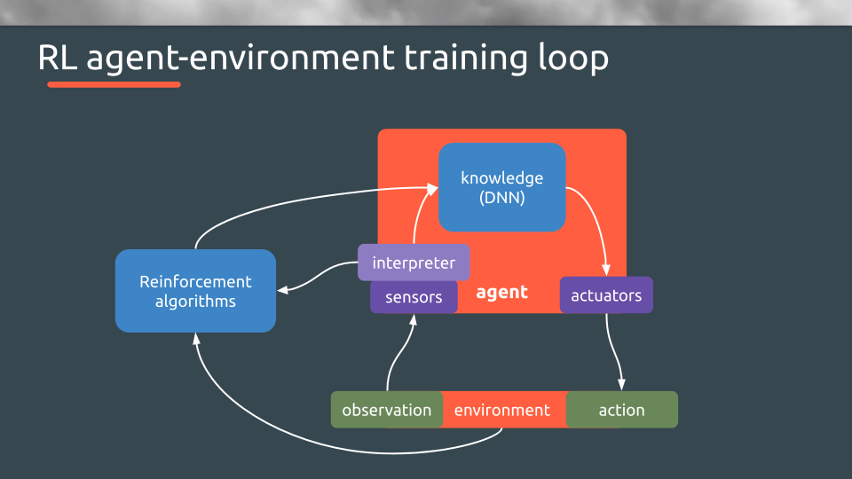
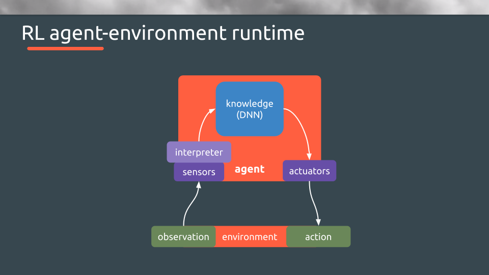

MAD_RL_ Framework (Work in Progress)
===

This framework borned in paralel to the starting of the [MAD_RL_](https://www.meetup.com/MAD_RL/) collective. A group of people interested on Reinforcement Learning area within Artificial Intelligence. MAD_RL_ shares the idea that RL and other semi-supervised learning techniques will require experience from many different fields to evolve. Some obvious such as Mathematics or Software Engineering, but also others less obvious such as Psychology, Neuroscience and others even more distant as Philosophy or Sociology, just to name a few.

The goal of this framework is to allow researchers and practiotioners to have a pretty clear architecture from the point of view of the RL concepts, and also beaing totally agnostic from libraries and environments.

## Architecture

We have split the environment in different components trying to simplify the implementation of new algorithms. These components are very common in most of the RL approaches.

The main idea of this approach is to isolate the different components to ley the coder focus on one component at a time. Also this approach ensures that the agent will be trained in a way that will work in an inference environment. This is very important because depending on the context the agent won't access to the same information during the training than in the runtime.

### Training Loop


### Runtime



### Components Summary

The components we have split the framework are:

#### The Environment
 * **Environment:** An environment define the rules where the agents will interact. We currently have Gym[Atari] and Retro already implemented with several agents and algorithms working.

#### The Agent

 * **Agent:** The base define an interface that should be able to integrate in any RL environment.
 * **Sensors:** The sensors are the different way to get information from the environment in a runtime context.
 * **Interpreters:** The interpreters are a bridge between Sensors and other parts of the agent, they transforms the information taken by the sensors and apply any transformation or process to provide other parts in the agent the information ready to use.
 * **Actuators:** The actuators translate the agent decisions into something comprehensible by the environment.
 * **Experiences:** The experiences are very related with the RL approach / algorithm used. However the concept is almost alway the same, this component allows to isolate the experience approach.
 * **Knowledge:** The knowledge is where the algorithm must be implemented, here the learning must be saved and accessed in order to take decisions.

## Installation

### Conda environemnts
```
conda env create -f madrl_env.yml
```

### Test the environment

```
PYTHONPATH=./src/ AGENT_MODULE=environments._test_env._test_agent.agent python ./src/environments/_test_env/train_agent.py
```

## Environments

### Gym[Atari]

The OpenAI Gym is one of the standars to apply RL algorithms in videogames. This enviroment is focused on Atari games.

### Installation

```
conda env update -f ./environments/gym_atari/madrl_gym_atari_env.yml
```

### Agents

#### Breakout Actor-Critic Policy Grading

```
PYTHONPATH=./src/ GAME=BreakoutDeterministic-v4 AGENT_MODULE=environments.gym_atari.breakout_actor_critic_policy.agent python ./src/environments/gym_atari/train_agent.py
```

#### Breakout Actor-Critic DQN

```
PYTHONPATH=./src/ GAME=BreakoutDeterministic-v4 AGENT_MODULE=environments.gym.breakout_actor_critic_policy.agent python ./src/environments/gym/train_agent.py
```


### Gym Retro

The OpenAI Gym Retro is the same than Gym Atari but using 8bit/16bit consoles emulators to apply RL algorithms in that videogames.

### Installation

```
conda env update -f ./environments/gym_retro/madrl_gym_retro_env.yml
```

You will need to find the video game ROM and download it before running any agent. In order to load the ROM into Retro please follow these instrucions:

```
...
```

### Agents

#### Street Fighter II

```
PYTHONPATH=./src/ GAME=StreetFighterIISE AGENT_MODULE=environments.gym_retro.sfii_a3c.agent python ./src/environments/gym_retro/train_agent.py
```

